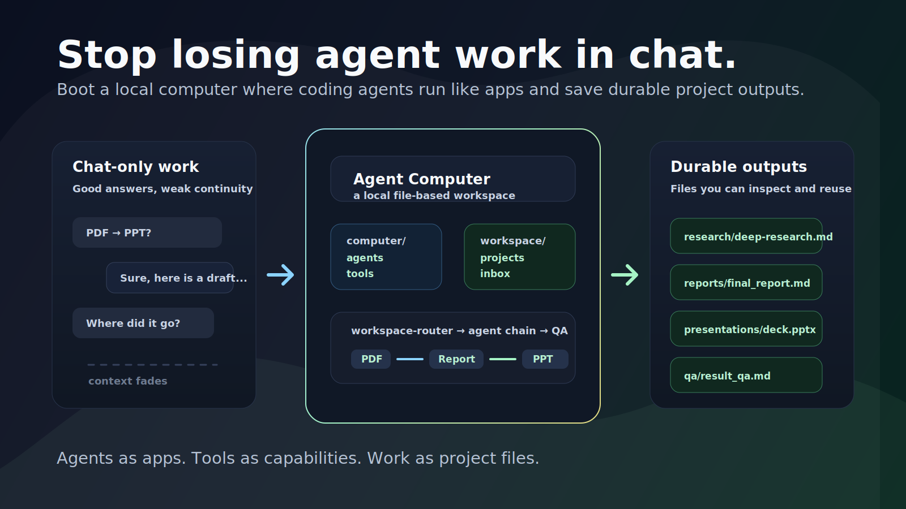
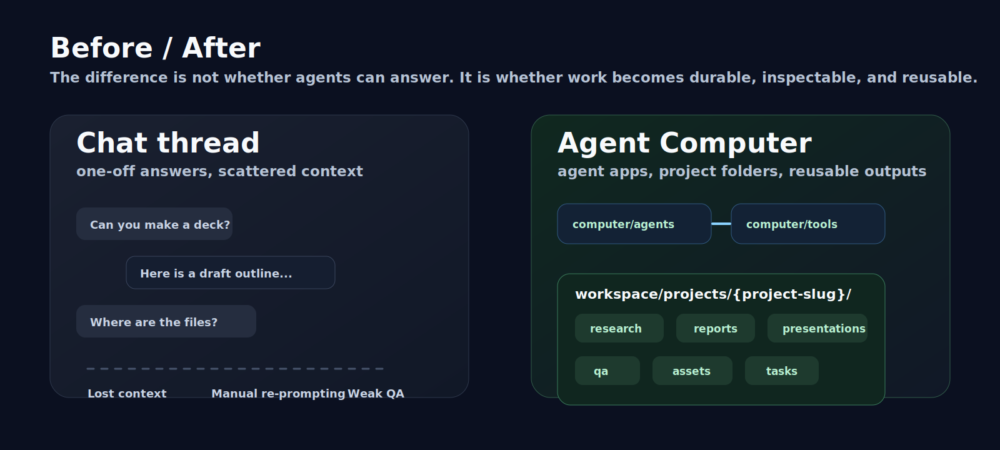
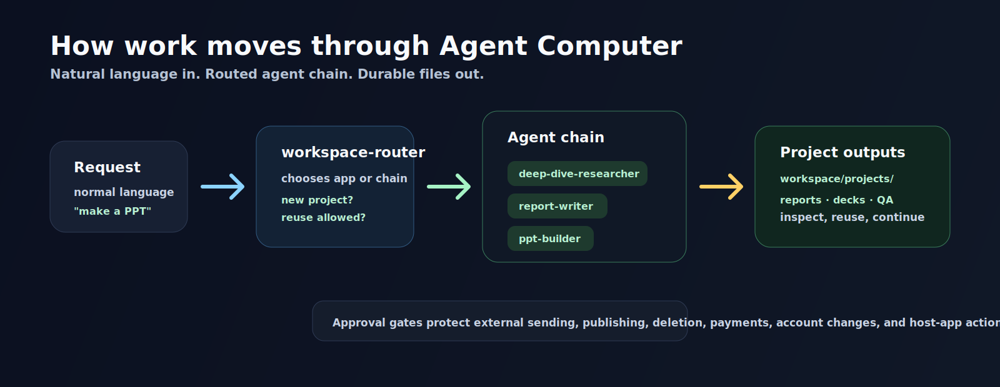

# Agent Computer

Stop losing agent work in chat history. Boot an Agent Computer.


Agent Computer is a local, file-based workspace where Codex, Claude Code, and similar coding agents run agents like apps. A single request can become a routed workflow, project folder, research brief, report, editable deck, draft, converted document, and QA log.

It is designed to be opened with coding agents such as Codex, Claude Code, or any assistant that can read and write files.

> Unofficial project. Not affiliated with OpenAI, Anthropic, or any model provider.

Status: experimental V0 preview. Agent Computer is intended for coding-agent power users who are comfortable opening a local folder with Codex, Claude Code, or a similar file-editing agent.

New here? Start with [START_HERE.md](START_HERE.md).

## Why This Exists

Most agent work disappears inside chat history. Agent Computer gives agents a durable workspace:

- agents are apps
- tools are executable capabilities
- reports, decks, drafts, and converted files are outputs
- memory is stored as Markdown
- tasks and indexes make work recoverable
- the operating layer lives under `computer/`
- user work lives under `workspace/`



The goal is to make AI work feel less like one-off prompting and more like using a computer built for agents.



## Why Not Just Use Codex Directly?

You can. Agent Computer is for the moment when you want coding-agent work to become durable, inspectable project artifacts instead of one-off chat output.

```text
plain coding agent
-> helpful answer in chat

Agent Computer
-> routed agent workflow
-> workspace/projects/{project-slug}/
-> research, reports, decks, drafts, converted docs, memory, and QA logs
```

## Showcase Workflow

Try one high-signal workflow:

```text
Research newsletter success cases deeply, extract the repeatable growth formulas, and turn the findings into a rich editable PPT.
```

Expected route:

```text
deep-dive-researcher -> report-writer -> ppt-builder -> qa-verifier
```

Expected output shape:


```text
workspace/projects/newsletter-success-formula/
  research/
  reports/
  presentations/
  qa/
```

The important part is not the example topic. It is the pattern: natural-language work becomes a project folder with artifacts you can inspect, edit, continue, and share.

## Boundary Rule

Agent Computer treats this folder as the primary computer. The host Mac is just the runtime.

By default, requests should be handled with workspace-native agents, files, tools, memory, and project folders:

- contacts live in `computer/memory/private/email-contacts.json`, not macOS Contacts
- email work creates draft packages first, not real sends
- memory lives in `computer/memory/`, not external note apps
- file organization uses dry-runs and manifests, not Finder by default
- deck work uses `ppt-builder` artifacts, not PowerPoint/Keynote automation by default

External apps and accounts are peripherals. They are used only when the user explicitly requests that external system and approves the action.

## Quick Start

1. Copy or clone this folder.
2. Open it with Codex, Claude Code, or another coding agent.
3. If using Codex, ask it to read `AGENTS.md`. If using Claude Code, ask it to read `CLAUDE.md`.
4. Ask for work in normal language:

```text
Research newsletter success cases deeply, extract the repeatable growth formulas, and turn the findings into a rich editable PPT.
```

Or:

```text
Convert this PDF into an agent-readable document, then create a report and presentation from it.
```

Agent Computer should route the request to installed agents, create a project folder, save durable outputs under `workspace/projects/{project-slug}/`, and QA the result when appropriate.

### Optional Local CLI

The npm commands are developer and smoke-test helpers. They are not the primary user experience.

Run the built-in demo only when you want to verify the local tools:

```bash
npm run demo
```

This creates a sample converted Markdown file, quick research brief, report, editable PPTX deck, PPT workflow QA, report QA, and workspace index. It does not create a full-slide screenshot deck.

You can also route a task before running it:

```bash
npm run route -- "turn this PDF into a report and ppt deck"
```

Or run an agent task directly:

```bash
npm run agent -- ingest path/to/source.pdf
npm run agent -- report workspace/projects/source/converted/source.agent.md
npm run agent -- ppt workspace/projects/source/reports/source_report.md --title "Source Report"
npm run agent -- ppt workspace/projects/source/reports/source_report.md --title "Source Report" --plan-only
npm run agent -- organize --policy project-based --dry-run
```

Then ask your coding agent to operate the workspace:

```text
Use deep-dive-researcher to research how Farnam Street grew, then use report-writer to turn it into a report.
```

Or:

```text
Use document-ingestor to convert this PDF into agent-readable Markdown, then use ppt-builder to plan, prototype, QA, and reconstruct an editable deck.
```

PDF rendering first tries the local PDFJS helper (`pdfjs-dist` plus `@napi-rs/canvas`, including the Codex Desktop bundled runtime when available), then falls back to Poppler (`pdftoppm`). PDF outputs include rendered pages, page notes, contact sheets, and `visual-review.md` for the page-by-page vision pass. PPTX visual rendering requires LibreOffice (`soffice`) and Poppler. If required tools are missing, Agent Computer fails clearly instead of pretending conversion succeeded.

## Project Isolation

New requests create new project folders by default. Agent Computer should not reuse a similar existing project unless the user explicitly asks to continue, update, improve, or base the work on previous outputs.

If a related project exists, the agent may mention it as optional context, but should keep the new work in a fresh `workspace/projects/{project-slug}/` folder unless the user approves reuse.

## Default Apps

### System Agents

- `workspace-router`: chooses the right agent or agent chain
- `agent-builder`: builds executable agent apps
- `document-ingestor`: converts files into agent-readable Markdown
- `file-organizer`: plans, moves, logs, and can undo workspace file organization
- `memory-curator`: maintains useful memory
- `qa-verifier`: checks quality and missing evidence

### Work Agents

- `quick-researcher`: fast, focused research with sources
- `deep-dive-researcher`: deep research with evidence and causality
- `report-writer`: structured reports and documents
- `ppt-builder`: high-quality PPT workflow with content/design specs, prototype QA, and editable reconstruction gates
- `email-operator`: emails, replies, and follow-ups

### Personal Agents

- `friend-counselor`: thoughtful reflection and supportive conversation

## Directory Structure

Agent Computer separates its files into two layers:

- operating layer: agent apps, policies, tools, templates, docs, and memory
- user output layer: project folders, source files, reports, decks, QA, and staging areas

Most users should start in `workspace/projects/`. See [Workspace Structure](computer/docs/workspace-structure.md) for the full folder model.



```text
agent-computer/
  AGENTS.md
  CLAUDE.md
  README.md

  # operating layer
  computer/
    agents/
      system/
      work/
      personal/
    system/
    tools/
    templates/
    docs/
    examples/
    memory/

  # user output layer
  workspace/
    inbox/
    tasks/
    projects/
      {project-slug}/
        source/
        converted/
        research/
        reports/
        presentations/
        qa/
        assets/
        tasks/
        archive/
    outputs/
    converted/
    reports/
    archive/
    trash/
```

During normal use, the operating layer runs the computer and the user output layer stores the work.

## Agent Apps Are Executable

An agent app should not be just a prompt. A useful agent app can include:

- role and workflow docs
- tools and scripts
- templates
- tests or QA checklists
- examples
- memory rules

For example, `document-ingestor` includes a V0 requirement to render PDF/PPTX pages into images and convert each page into faithful Markdown.

## V0 Standard

V0 default agents are intended to be working apps, not prompt-only stubs.

Each V0 default agent should include:

- clear role and boundaries
- workflow
- output template
- concrete workspace action path
- QA or self-check guidance
- safe handling of uncertainty and external actions

## Runtime Guides

- [Codex](computer/docs/runtimes/codex.md)
- [Claude Code](computer/docs/runtimes/claude-code.md)
- [Always-On Routing](computer/docs/always-on-routing.md)
- [Human-in-the-Loop](computer/docs/human-in-the-loop.md)
- [Chain Checkpoints](computer/docs/chain-checkpoints.md)
- [Engineering Principles](computer/docs/engineering-principles.md)
- [Workspace Structure](computer/docs/workspace-structure.md)

## Known Limitations

Agent Computer is an experimental V0 preview.

- It is designed for coding-agent power users, not nontechnical one-click onboarding yet.
- Output quality depends on the coding agent runtime, available tools, and the task prompt.
- Some document and PPT visual QA depends on local renderers such as PDFJS, LibreOffice, Poppler, or other available tooling.
- External accounts, real email sending, public posting, deletion, payments, and host-app automation require explicit user approval.

## Project Docs

- [Contributing](CONTRIBUTING.md)
- [Security](SECURITY.md)
- [Changelog](CHANGELOG.md)
- [Release Checklist](RELEASE_CHECKLIST.md)

## Public Safety

Do not store secrets, API keys, private customer data, or personal information in this workspace.

Use `computer/memory/*.example.md` for public examples and keep real memory private.

## License

MIT
