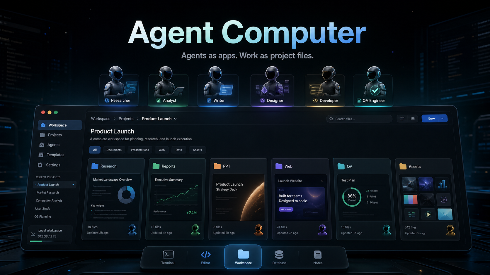
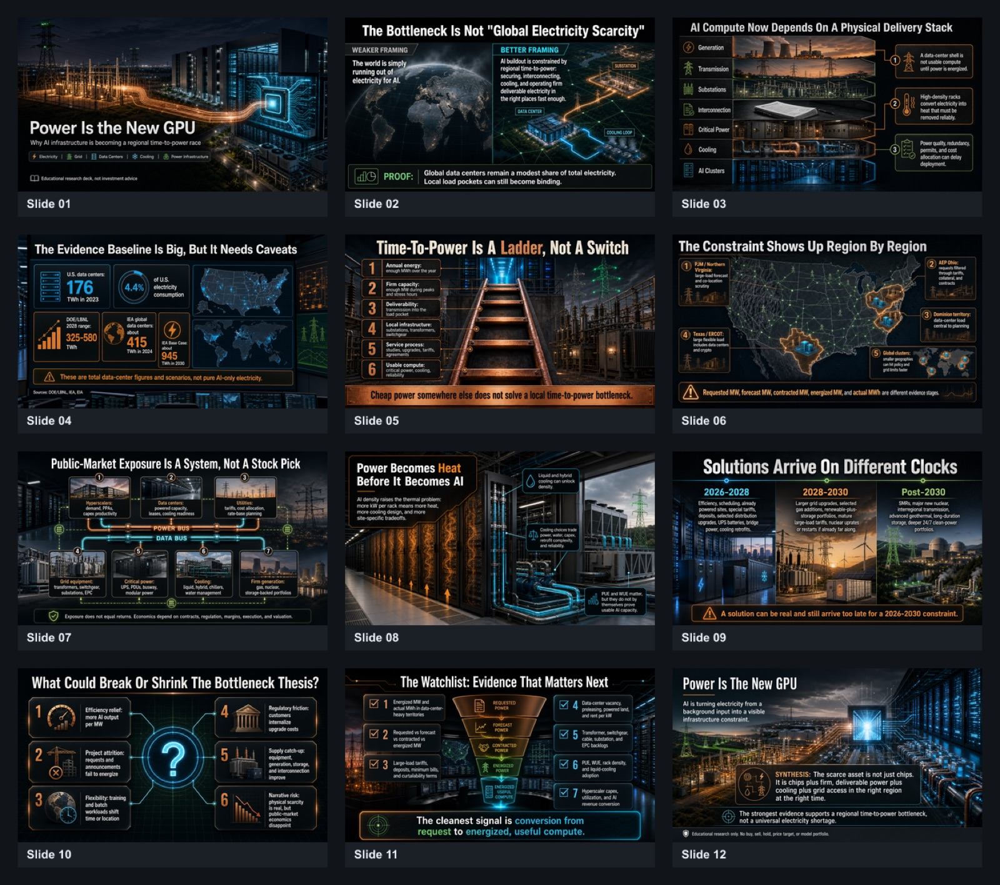
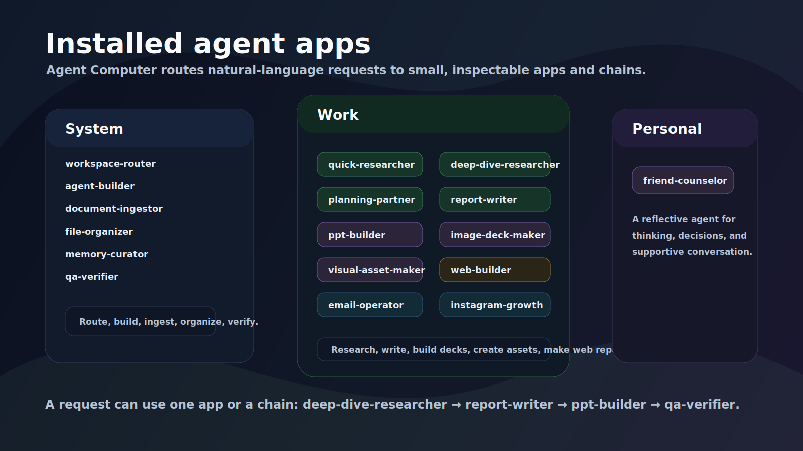
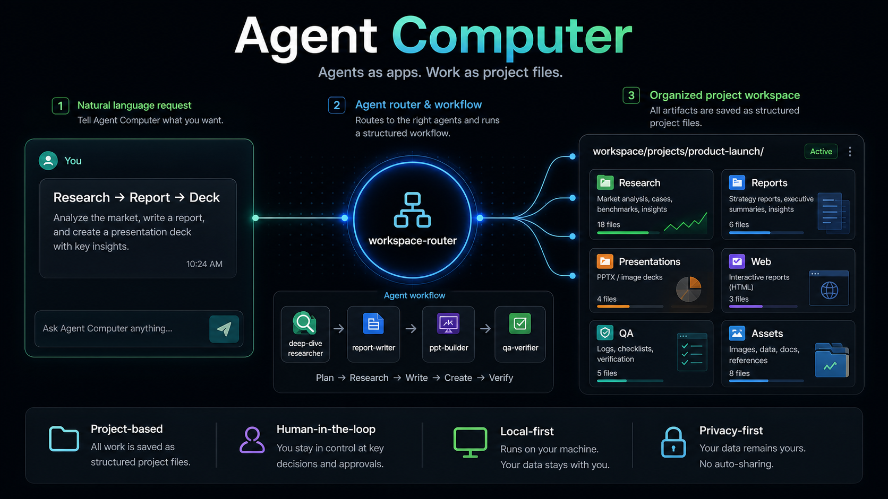
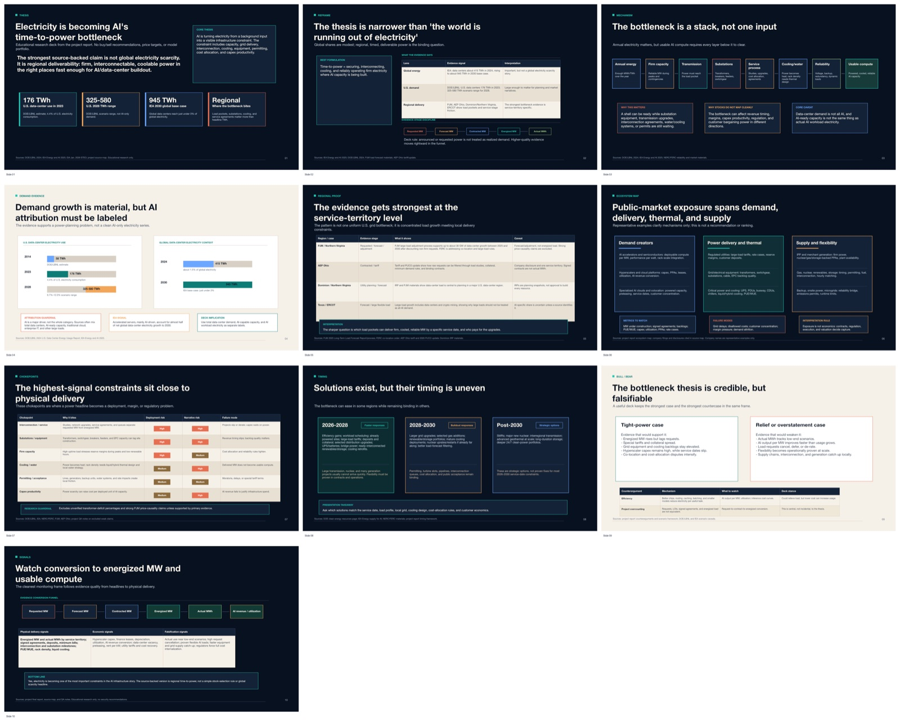
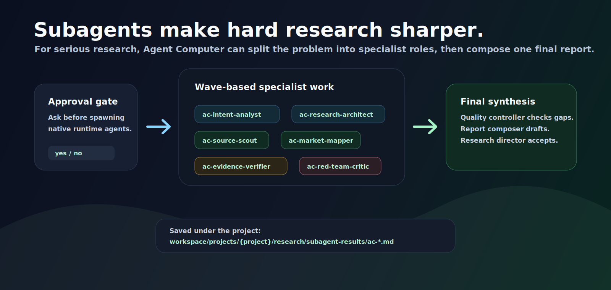

# Agent Computer

**A computer operated by agents.**

Not a chatbot. Not another automation script. Open this folder with Codex, Claude Code, or any file-editing coding agent, then ask for work in natural language.

Agents run installed apps, use tools, create project folders, and leave behind top-tier work artifacts: deep research reports, interactive web reports, editable decks, image-generated decks, source maps, memory, and QA.

[](https://github.com/YEOPHYEONG/agent-computer/releases)
[](LICENSE)
[](package.json)
[](computer/agents/README.md)



## What It Is

Agent Computer is a repo-shaped local computer operated by coding agents. It changes the default output from "an answer in chat" to **a project folder full of inspectable work**:

```text
natural-language request
-> routed agent workflow
-> workspace/projects/{project-slug}/
-> research, reports, decks, web pages, images, converted docs, memory, and QA
```

It is not a SaaS platform, daemon, or replacement for Codex/Claude Code. It is an operating layer that makes coding agents behave more like workspace-native operators.

Open the folder with Codex, Claude Code, or any file-editing coding agent. Then ask in normal language:

```text
Research newsletter success cases deeply, extract the repeatable growth formulas, and turn the findings into a rich editable PPT.
```

Agent Computer should route the work, create a fresh project folder, run the right agent chain, save the research/report/deck/QA files, and keep the result easy to inspect, edit, continue, or share later.

## See It Work

This is not a hand-built mockup.

One ordinary research question:

```text
Is electricity becoming the next big bottleneck for AI stocks?
```

A human provided the topic and boundaries. Agent Computer handled the workflow: research planning, source-backed synthesis, report writing, interactive web report, editable PPT deck, full-slide image deck, source mapping, claim verification, and QA.

The result became a complete workspace project with:

- a [source-backed research report](computer/examples/showcases/power-is-the-new-gpu/research-report.md)
- an [interactive local HTML report](computer/examples/showcases/power-is-the-new-gpu/web/ai-electricity-bottleneck-report/index.html)
- an [editable PPTX deck](https://github.com/YEOPHYEONG/agent-computer/releases/download/v0.1.1/electricity-ai-time-to-power-bottleneck-deck.pptx)
- a full-slide `$imagegen` visual deck ([PPTX](https://github.com/YEOPHYEONG/agent-computer/releases/download/v0.1.1/power-is-the-new-gpu-image-deck.pptx), [PDF](https://github.com/YEOPHYEONG/agent-computer/releases/download/v0.1.1/power-is-the-new-gpu-image-deck.pdf))
- [source maps](computer/examples/showcases/power-is-the-new-gpu/source-map.md), [claim verification](computer/examples/showcases/power-is-the-new-gpu/claim-verification-map.md), and QA notes



See the full showcase: [Power Is the New GPU](computer/examples/showcases/power-is-the-new-gpu/README.md).

> Unofficial project. Not affiliated with OpenAI, Anthropic, or any model provider.

Status: experimental V0 preview for coding-agent power users.

New here? Start with [START_HERE.md](START_HERE.md), or jump to [Quick Start](#quick-start).

## The Idea

Most coding-agent work is still trapped in a chat loop:

```text
prompt -> answer -> scroll away -> repeat
```

Agent Computer turns the same agent into a workspace-native operator:

```text
request
-> route to installed agent apps
-> create workspace/projects/{project-slug}/
-> produce research, reports, decks, web pages, drafts, converted docs, assets, memory, and QA
```

The mental model is simple:

- agents are apps
- tools are executable capabilities
- the operating layer lives under `computer/`
- user work lives under `workspace/`
- outputs are durable files
- QA and evidence trails are part of the work


The goal is to make AI work feel less like one-off prompting and more like using a computer built for agents.


## What It Can Do

Agent Computer ships with working agent apps for:

- deep research that asks better questions, uses evidence, and can use native subagents
- report writing from notes, research packages, converted docs, or rough inputs
- editable PPT decks with content specs, design specs, prototypes, reconstruction, and QA
- full-slide `$imagegen` image decks and campaign/social/thumbnail visual assets
- local HTML pages and interactive web reports from approved source material
- PDF/PPTX/DOCX/image ingestion into agent-readable Markdown
- workspace organization with dry-runs, manifests, and undo
- email draft packages, local contact memory, and follow-up sequences
- QA verification for reports, PPTX packages, routing, and safety boundaries
- building new executable agent apps with tools, templates, tests, and docs



## Why Not Just Use Codex Directly?

You can. Agent Computer is for the moment when you want coding-agent work to become durable, inspectable project artifacts instead of one-off chat output.

```text
plain coding agent
-> helpful answer in chat

Agent Computer
-> routed agent workflow
-> workspace/projects/{project-slug}/
-> research, reports, decks, web pages, drafts, converted docs, memory, and QA logs
```

Agent Computer does not replace the model. It gives the model a filesystem, operating rules, agent apps, project memory, and quality gates.

## Showcase Workflow

Try one high-signal workflow:

```text
Research newsletter success cases deeply, extract the repeatable growth formulas, and turn the findings into a rich editable PPT.
```

Expected route:

```text
deep-dive-researcher -> report-writer -> ppt-builder -> qa-verifier
```

For HTML or interactive web reports, deep research still produces its own full Markdown report first. The web artifact is built separately:

```text
deep-dive-researcher -> report-writer -> web-builder -> qa-verifier
```

Expected output shape:



```text
workspace/projects/newsletter-success-formula/
  research/
  reports/
  presentations/
  web/
  qa/
```

The important part is not the example topic. It is the pattern: natural-language work becomes a project folder with artifacts you can inspect, edit, continue, and share.

## Full Showcase Files

The `Power Is the New GPU` showcase includes the report, web page, editable deck, image-generated deck, source map, claim verification, and QA notes in one public-safe example folder.



Open the full showcase: [Power Is the New GPU](computer/examples/showcases/power-is-the-new-gpu/README.md).

## Best First Prompts

Use normal language. These are intentionally written like user requests, not CLI commands:

```text
How do I use this workspace?
```

```text
Convert the PDF in workspace/inbox into an agent-readable document, then create a report and PPT.
```

```text
Research this market deeply, write the full Markdown report, then turn it into an interactive HTML page.
```

```text
Use Agent Computer subagents if they would improve this research. Ask me before spawning native subagents.
```

```text
Create a text-rich full-slide image deck from this approved report. Use $imagegen for the final slide images.
```

## Boundary Rule

Agent Computer treats this folder as the primary computer. The host Mac is just the runtime.

By default, requests should be handled with workspace-native agents, files, tools, memory, and project folders:

- contacts live in `computer/memory/private/email-contacts.json`, not macOS Contacts
- email work creates draft packages first, not real sends
- memory lives in `computer/memory/`, not external note apps
- file organization uses dry-runs and manifests, not Finder by default
- deck work uses `ppt-builder` artifacts, not PowerPoint/Keynote automation by default

External apps and accounts are peripherals. They are used only when the user explicitly requests that external system and approves the action.

## Quick Start

1. Copy or clone this folder.
2. Open it with Codex, Claude Code, or another coding agent.
3. If using Codex, ask it to read `AGENTS.md`. If using Claude Code, ask it to read `CLAUDE.md`.
4. Put source files in `workspace/inbox/` when you have them.
5. Ask for work in normal language:

```text
Research newsletter success cases deeply, extract the repeatable growth formulas, and turn the findings into a rich editable PPT.
```

Or:

```text
Convert this PDF into an agent-readable document, then create a report and presentation from it.
```

Agent Computer should route the request to installed agents, create a project folder, save durable outputs under `workspace/projects/{project-slug}/`, and QA the result when appropriate.

You do not need to run npm commands for normal use. The npm scripts are optional helper tools for smoke tests, demos, routing checks, and local automation.

### Subagents For Hard Research

For serious research, strategy, market, product, GTM, technical, or source-heavy work, explicitly allowing subagents can improve the result. The reason is simple: Agent Computer can split the work into specialist roles for intent analysis, research architecture, source scouting, market mapping, mechanism analysis, evidence verification, red-team critique, quality control, and final report composition.

Try phrasing it like this:

```text
Use Agent Computer subagents if they would improve this research. Ask me before spawning native subagents, then save their findings under the project folder.
```

Subagents are not useful for every task. They add coordination overhead, so Agent Computer should use them mainly when multiple specialist viewpoints will materially improve the answer.



| Agent app | Native subagent support | When it helps |
|---|---|---|
| `deep-dive-researcher` | Yes. Codex ships `.codex/agents/ac-*.toml` for the canonical research roles. | Serious market, strategy, product, technical, source-heavy, benchmark, or investment-adjacent research. |
| `planning-partner` | Not directly by default. It can hand off to `deep-dive-researcher` when evidence or specialist research is needed. | Vague ideas where the real decision, audience, or direction is still unclear. |
| `report-writer` | Usually no. It should consume research packages and composer drafts rather than spawn new research workers by itself. | Turning approved research, notes, or converted sources into a structured report. |
| `web-builder` | No research subagents by default. It should build from an approved report or research package. | Turning a finished report into a local HTML page or interactive web report. |
| `ppt-builder` | No research subagents by default. It should build from approved source material, specs, and QA gates. | Creating editable PPTX decks from known source content. |
| `image-deck-maker` | No research subagents by default. It is `$imagegen`-native and should work from approved source content and locked slide text. | Creating full-slide generated image decks where visual impact matters more than editability. |
| `visual-asset-maker` | No research subagents by default. It is `$imagegen`-native and should work from approved copy and creative direction. | Creating campaign images, thumbnails, social assets, launch visuals, and showcase images. |
| `document-ingestor`, `file-organizer`, `memory-curator`, `email-operator`, `qa-verifier` | No native subagents by default. | These are usually better as focused single-agent workflows with clear approval gates. |

Codex does not spawn subagents automatically. Agent Computer includes project-scoped Codex custom agents under `.codex/agents/ac-*.toml`, but for serious research it should ask for explicit approval before using them. If approved, subagent findings should be saved or summarized under `workspace/projects/{project-slug}/research/subagent-results/ac-*.md` before the final report is composed.

Claude Code can use the same canonical Agent Computer role specs, but project-level Claude subagent files should be materialized only when the user explicitly approves that runtime setup.

### Optional Local CLI

The npm commands are developer and smoke-test helpers. They are not the primary user experience.

Run the built-in demo only when you want to verify the local tools:

```bash
npm run demo
```

This creates a sample converted Markdown file, quick research brief, report, editable PPTX deck, PPT workflow QA, report QA, and workspace index. It does not create a full-slide screenshot deck.

You can also route a task before running it:

```bash
npm run route -- "turn this PDF into a report and ppt deck"
```

Or run an agent task directly:

```bash
npm run agent -- ingest path/to/source.pdf
npm run agent -- report workspace/projects/source/converted/source.agent.md
npm run agent -- web workspace/projects/source/reports/source_report.md --title "Source Web Report"
npm run agent -- ppt workspace/projects/source/reports/source_report.md --title "Source Report"
npm run agent -- ppt workspace/projects/source/reports/source_report.md --title "Source Report" --plan-only
npm run agent -- organize --policy project-based --dry-run
```

Then ask your coding agent to operate the workspace:

```text
Use deep-dive-researcher to research how Farnam Street grew, then use report-writer to turn it into a report.
```

Or:

```text
Use document-ingestor to convert this PDF into agent-readable Markdown, then use ppt-builder to plan, prototype, QA, and reconstruct an editable deck.
```

PDF rendering first tries the local PDFJS helper (`pdfjs-dist` plus `@napi-rs/canvas`, including the Codex Desktop bundled runtime when available), then falls back to Poppler (`pdftoppm`). PDF outputs include rendered pages, page notes, contact sheets, and `visual-review.md` for the page-by-page vision pass. PPTX visual rendering requires LibreOffice (`soffice`) and Poppler. If required tools are missing, Agent Computer fails clearly instead of pretending conversion succeeded.

## Project Isolation

New requests create new project folders by default. Agent Computer should not reuse a similar existing project unless the user explicitly asks to continue, update, improve, or base the work on previous outputs.

If a related project exists, the agent may mention it as optional context, but should keep the new work in a fresh `workspace/projects/{project-slug}/` folder unless the user approves reuse.

## Default Apps

Agent Computer ships with installed agent apps. A request can use one app or a chain of apps.

| Agent app | Use it for |
|---|---|
| `workspace-router` | Choosing the right agent or agent chain. |
| `agent-builder` | Building new executable agent apps with tools, templates, tests, and docs. |
| `document-ingestor` | Converting PDF/PPTX/DOCX/images/text into agent-readable Markdown. |
| `file-organizer` | Planning, moving, logging, and undoing workspace organization. |
| `memory-curator` | Maintaining reusable context without storing secrets. |
| `qa-verifier` | Checking output quality, evidence gaps, package validity, and safety issues. |
| `quick-researcher` | Fast focused research with sources. |
| `deep-dive-researcher` | Serious research with questions, evidence, causality, source confidence, and optional native subagents. |
| `planning-partner` | Multi-turn planning for ideas, services, brands, campaigns, communities, content, and projects. |
| `report-writer` | Turning notes, sources, research packages, or rough inputs into structured reports. |
| `web-builder` | Building local static HTML pages and interactive web reports from approved source material. |
| `ppt-builder` | Creating high-quality editable PPTX decks with content/design specs, prototype QA, and reconstruction gates. |
| `image-deck-maker` | Creating text-rich full-slide generated image decks with `$imagegen`. |
| `visual-asset-maker` | Creating campaign, social, thumbnail, banner, launch, and showcase images with `$imagegen`. |
| `email-operator` | Writing email draft packages, replies, and follow-up sequences. |
| `instagram-growth-analyst` | Analyzing local Instagram performance data and proposing growth experiments. |
| `friend-counselor` | Thoughtful reflection and supportive conversation. |

## Directory Structure

Agent Computer separates its files into two layers:

- operating layer: agent apps, policies, tools, templates, docs, and memory
- user output layer: project folders, source files, reports, decks, QA, and staging areas

Most users should start in `workspace/projects/`. See [Workspace Structure](computer/docs/workspace-structure.md) for the full folder model.


```text
agent-computer/
  AGENTS.md
  CLAUDE.md
  README.md

  # operating layer
  computer/
    agents/
      system/
      work/
      personal/
    system/
    tools/
    templates/
    docs/
    examples/
    memory/

  # user output layer
  workspace/
    inbox/
    tasks/
    projects/
      {project-slug}/
        source/
        converted/
        research/
        reports/
        presentations/
        web/
        qa/
        assets/
        tasks/
        archive/
    outputs/
    converted/
    reports/
    archive/
    trash/
```

During normal use, the operating layer runs the computer and the user output layer stores the work.

## Agent Apps Are Executable

An agent app should not be just a prompt. A useful agent app can include:

- role and workflow docs
- tools and scripts
- templates
- tests or QA checklists
- examples
- memory rules

For example, `document-ingestor` includes a V0 requirement to render PDF/PPTX pages into images and convert each page into faithful Markdown.

## V0 Standard

V0 default agents are intended to be working apps, not prompt-only stubs.

Each V0 default agent should include:

- clear role and boundaries
- workflow
- output template
- concrete workspace action path
- QA or self-check guidance
- safe handling of uncertainty and external actions

## Runtime Guides

- [Codex](computer/docs/runtimes/codex.md)
- [Claude Code](computer/docs/runtimes/claude-code.md)
- [Always-On Routing](computer/docs/always-on-routing.md)
- [Human-in-the-Loop](computer/docs/human-in-the-loop.md)
- [Chain Checkpoints](computer/docs/chain-checkpoints.md)
- [Engineering Principles](computer/docs/engineering-principles.md)
- [Workspace Structure](computer/docs/workspace-structure.md)

## Known Limitations

Agent Computer is an experimental V0 preview.

- It is designed for coding-agent power users, not nontechnical one-click onboarding yet.
- Output quality depends on the coding agent runtime, available tools, and the task prompt.
- Some document and PPT visual QA depends on local renderers such as PDFJS, LibreOffice, Poppler, or other available tooling.
- External accounts, real email sending, public posting, deletion, payments, and host-app automation require explicit user approval.

## Project Docs

- [Contributing](CONTRIBUTING.md)
- [Security](SECURITY.md)
- [Changelog](CHANGELOG.md)
- [Release Checklist](RELEASE_CHECKLIST.md)

## Public Safety

Do not store secrets, API keys, private customer data, or personal information in this workspace.

Use `computer/memory/*.example.md` for public examples and keep real memory private.

## License

MIT
