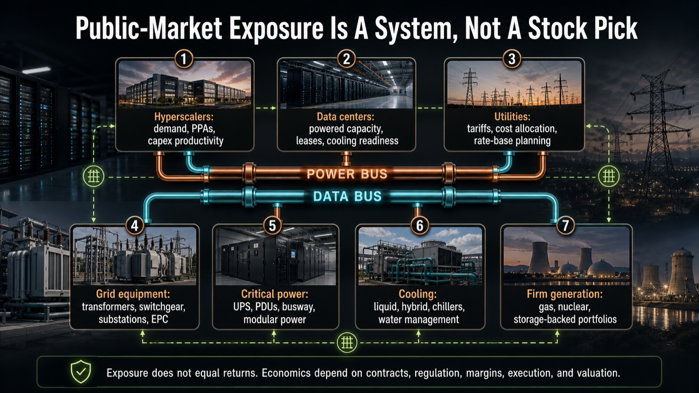
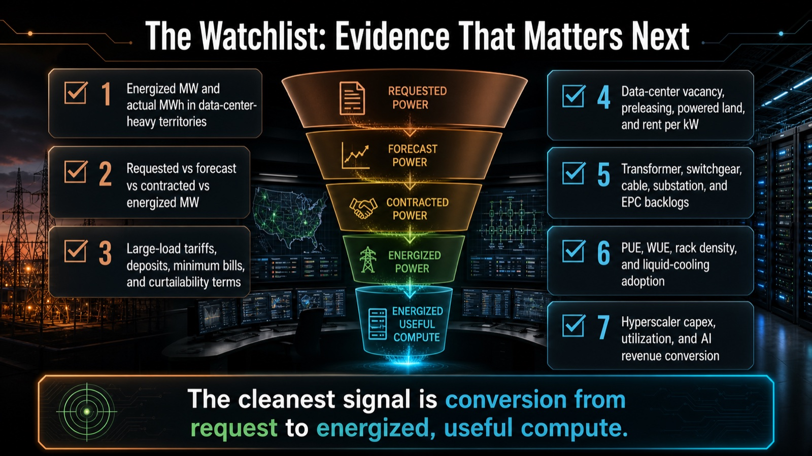

# Showcase: Power Is the New GPU

One natural-language research question became a project folder with four deliverables:

- a source-backed deep research report
- an editable PowerPoint deck
- a full-slide image-generated visual deck
- an interactive local HTML report

The prompt was intentionally ordinary:

```text
Is electricity becoming the next big bottleneck for AI stocks?

Can you research this deeply and write an English report?

Please treat it as educational research, not investment advice.
```

Agent Computer routed the work through deep research, source mapping, claim verification, report writing, presentation building, image-deck generation, web building, and QA.

## Result

The strongest source-backed framing is not global electricity scarcity. It is regional time-to-power: securing, interconnecting, cooling, and reliably operating firm deliverable electricity in the right regions quickly enough for AI/data-center buildout.

This showcase is educational market research only. It does not recommend buying, selling, holding, shorting, weighting, or avoiding any security. It does not include price targets, rankings, or a model portfolio.

## Deliverables

| Artifact | What it shows | Open it |
|---|---|---|
| Deep research report | Source-backed thesis, evidence baseline, ecosystem map, caveats, scenarios, and watch signals. | [research-report.md](research-report.md) |
| Source map | Tiered evidence backbone with source roles and caveats. | [source-map.md](source-map.md) |
| Claim verification map | Which claims were verified, softened, excluded, or avoided. | [claim-verification-map.md](claim-verification-map.md) |
| Interactive web report | A self-contained static HTML version of the research. | [web/ai-electricity-bottleneck-report/index.html](web/ai-electricity-bottleneck-report/index.html) |
| Research QA | Guardrails and final quality checks. | [research-qa.md](research-qa.md) |
| Web QA | Browser and interaction checks for the web report. | [web-report-qa.md](web-report-qa.md) |
| Editable PPT QA | Checks for the editable PowerPoint deck. | [editable-ppt-qa.md](editable-ppt-qa.md) |
| Image deck QA | Checks for the pure-imagegen visual deck. | [image-deck-qa.md](image-deck-qa.md) |

## Preview

### Image-generated visual deck


Representative slides from the full-slide `$imagegen` deck:





### Editable PowerPoint deck


## Large Files

To keep the repository lightweight, the full PPTX/PDF deck files are not committed here.

Recommended release assets:

- `electricity-ai-time-to-power-bottleneck-deck.pptx`
- `power-is-the-new-gpu-image-deck.pptx`
- `power-is-the-new-gpu-image-deck.pdf`

## What To Notice

- The report keeps total data-center demand, AI-capable capacity, and AI workload electricity separate.
- The public-market section is category-based and representative only, not a stock-picking screen.
- The image deck is high-impact but intentionally non-editable.
- The editable PPT uses native text, shapes, tables, bars, and diagrams.
- QA notes are part of the artifact, not an afterthought.
